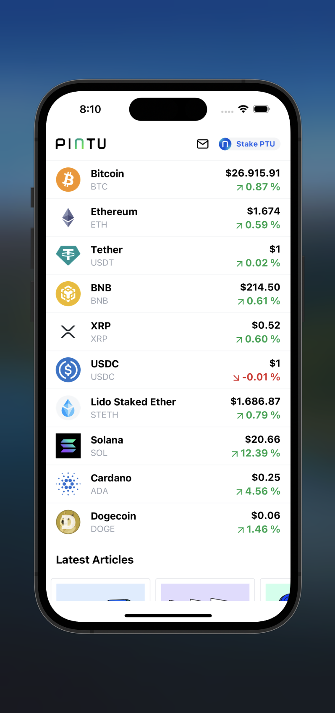
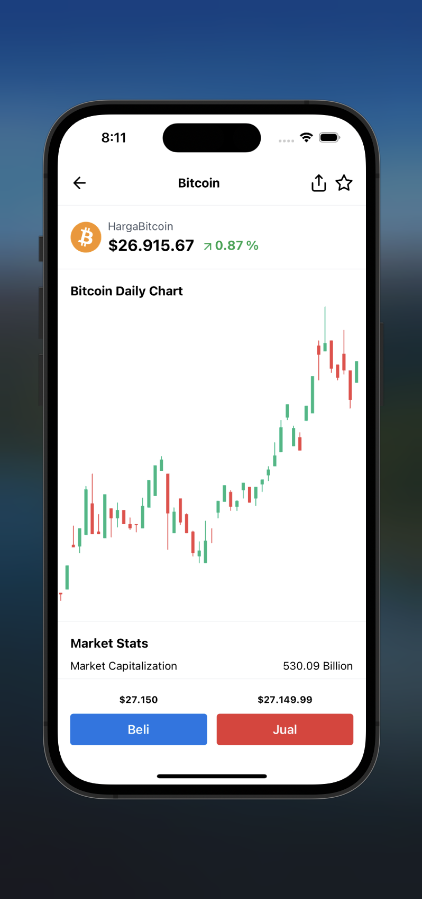

# KSCrypto App

KSCrypto App, a cryptocurrency application that was built using React Native, to display a list of top 10 cryptocurrencies coin realtime.

## API & Web Socket Stream

### API
KSCrypto App leverages data from the [Coin Gecko API](https://www.coingecko.com/en/api/documentation) to provide comprehensive cryptocurrency market data. Here are the available endpoints:

- **Get Markets:** Retrieve market data for various cryptocurrencies. Endpoint: `coins/markets`.

- **Get Charts:** Access historical price charts for specific cryptocurrencies. Endpoint: `coins/${id}/ohlc`.

### Web Socket
The app also utilizes the [Binance Websocket API](https://binance-docs.github.io/apidocs/spot/en/#websocket-market-streams) to provide real-time updates. Here are the available streams:

- **Ticker:** Get real-time ticker updates for specific cryptocurrency pairs. Stream: `ws/exampeusdt@ticker`.

- **Depths:** Receive depth information for order books of specific cryptocurrency pairs. Stream: `ws/exampeusdt@depths`.

## Package & Libraries
The KSCrypto App is built with several packages and libraries to enhance its functionality and user experience:

- **Expo:** A platform for building cross-platform mobile apps.

- **Gluestack UI:** A universal UI library that provides optionally styled and accessible components. These components are designed for easy integration into applications developed with React and React Native.

- **Axios:** A popular JavaScript library for making HTTP requests.

- **React Query:** A library for managing, caching, and synchronizing server state in React applications.

- **Runtypes:** A library for runtime type checking in JavaScript/TypeScript.

- **Loadash Throttle:** A utility library for throttling functions.

- **React Navigation:** A library for navigation in React Native applications.

- **Lucide Icon:** A collection of high-quality SVG icons.

- **Shopify Flashlist:** A Flatlist alternatives

## Previews
Here are some previews of the KSCrypto App:

| Home | Detail Coin | Order Book |
|---|---|---|
|  |   |   |

## Download
### Expo

